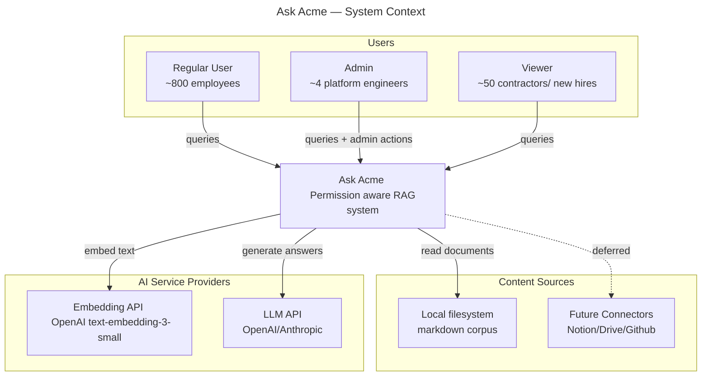
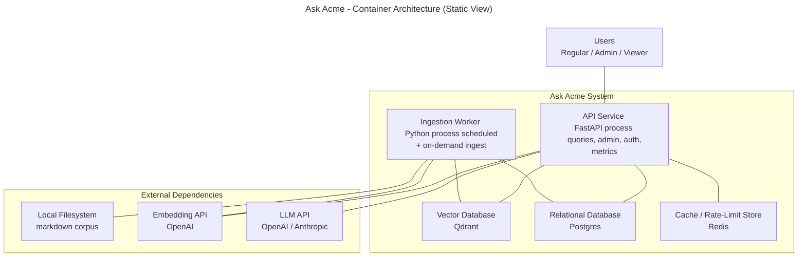
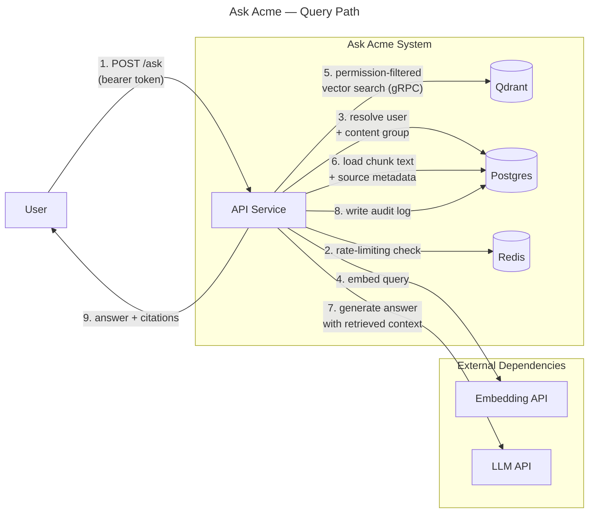
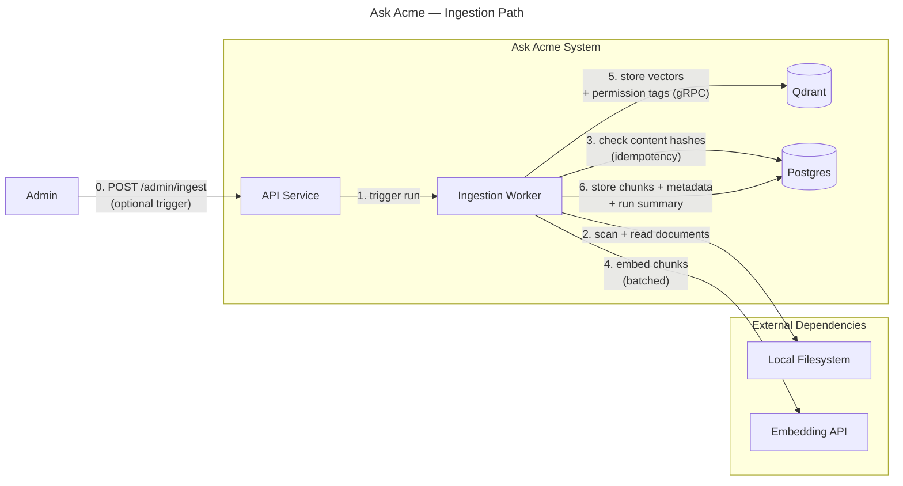
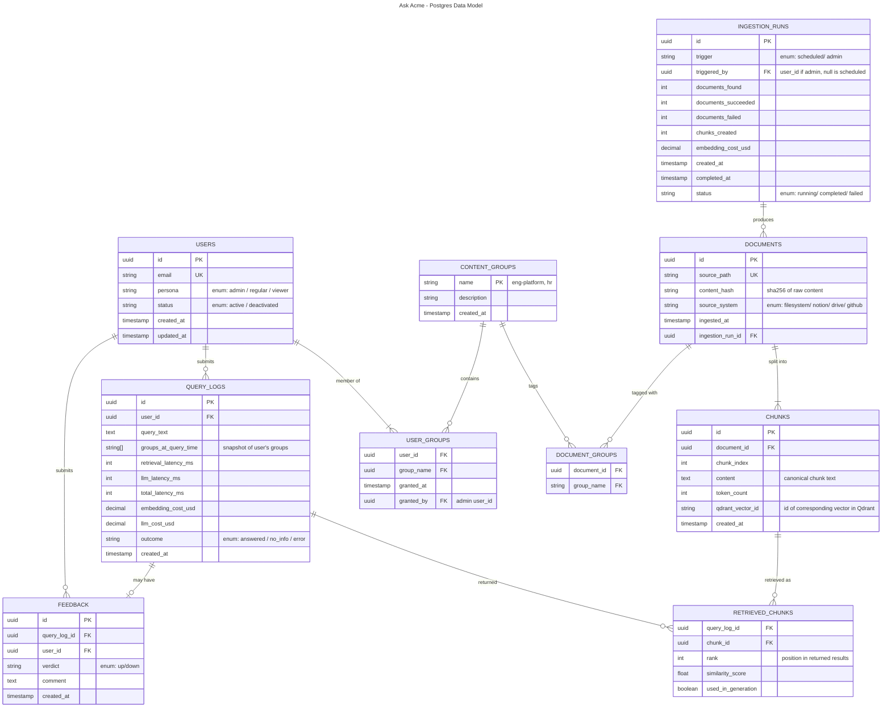
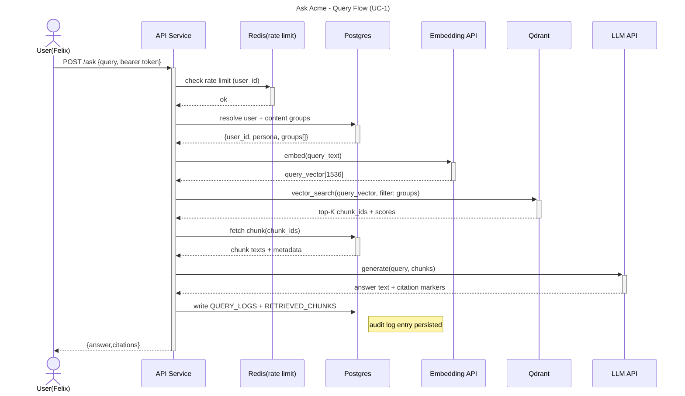
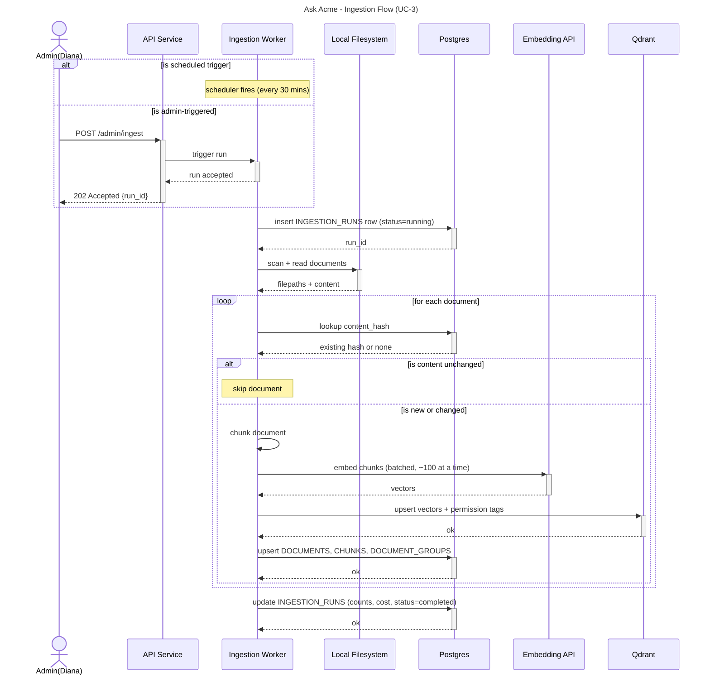
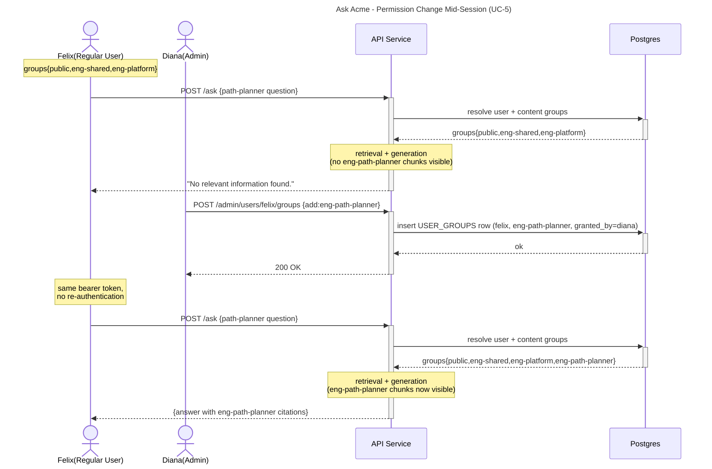

# Ask Acme — High-Level Design

**Status:** Locked
**Author:** Sanjoli Sirohi, Platform Engineering
**Last Updated:** _[date]_
**Prerequisite reading:** [PRD](../prd/PRD.md)

---

## 1. Overview

This document describes the high-level design of Ask Acme. It assumes the reader has read the [PRD](../prd/PRD.md).

The HLD covers:

- The system's external context (who calls it, what it depends on)
- The internal services that compose the system and how they communicate
- The data model
- The most important runtime flows (ingestion, query, permission change)
- Major technology choices, with brief justifications (full reasoning in ADRs)
- Cross-cutting concerns: observability, security, error handling, resilience
- Open questions deferred for design refinement during implementation

The HLD does **not** cover: per-component schemas, API contracts, or algorithms. Those live in the [LLD](../lld/LLD.md).

---

## 2. System Context

Ask Acme is an internal Q&A platform consumed by Acme Robotics employees. It depends on two categories of external services: AI services (for embeddings and language generation) and content sources (where documents originate). For v1, the only content source is a local directory of markdown files; future versions add real connectors (Notion, Drive, GitHub).

Users interact with Ask Acme via authenticated HTTPS requests to its API. The system does not consume external authentication directly; an Admin issues bearer tokens, and clients present those tokens on each request.

**Key facts visible in this diagram:**

- Ask Acme has three distinct user types, each with different permissions inside the system (see PRD §3).
- Ask Acme does not host LLMs locally. Every query reaches an external AI provider for both embedding and generation. This is acknowledged in PRD constraint C-1 and assumption A-6: on-premises deployment of the application is not the same as air-gapped operation.
- Future content connectors are shown as a dashed line — they are part of the system's design intent but not in v1 scope.
- The system has no internal-service consumers in v1.

---

## 3. Containers (Internal Architecture)

This section presents three views of the internal architecture:

- **3.1** — static view of containers and their connections
- **3.2** — dynamic view of the query path
- **3.3** — dynamic view of the ingestion path

### 3.1 Container Architecture (Static View)

The diagram below shows the five runtime units that make up Ask Acme, along with the external services they depend on. Lines indicate that two components communicate; direction of calls is shown in the dynamic diagrams.

**Container summary:**

| # | Container | Tech | Purpose |
|---|---|---|---|
| 1 | API Service | Python / FastAPI | Handles all HTTP requests: queries, admin actions, auth, metrics |
| 2 | Ingestion Worker | Python | Scheduled + on-demand document ingestion |
| 3 | Vector Database | Qdrant | Stores chunk embeddings with payload metadata |
| 4 | Relational Database | Postgres | Users, groups, documents, chunks (canonical text), query logs, feedback |
| 5 | Cache / Rate-Limit Store | Redis | Per-user rate-limit counters; short-lived state |

**Key architectural choices:**

- **API and Worker share data stores, not code-path.** Both write to Postgres and Qdrant; they're decoupled in process so heavy ingestion can't degrade query latency.
- **No direct communication between API and Worker** (except for admin-triggered runs). They communicate indirectly through the data stores.
- **The API service is intentionally monolithic for v1.** Query handling, admin endpoints, auth, and the metrics endpoint all live in one process.

### 3.2 Query Path (Dynamic View)

The diagram below traces what happens when a user submits a query. Arrows are numbered in execution order. Only containers that participate in the query path are shown; ingestion-only components are omitted.

**Reading the diagram:**

- Step 5 performs the vector search **with the permission filter applied as a payload filter inside Qdrant** — not as a post-processing step on returned chunks. This is FR-12's "no over-fetch" requirement.
- Step 6 fetches chunk text from Postgres using the IDs returned in step 5. Qdrant stores embeddings + permission tags only; canonical chunk text lives in Postgres.
- Step 8 (audit log) happens after the LLM call, before returning to the user. The audit log entry includes the user's content groups at query time.

### 3.3 Ingestion Path (Dynamic View)

The diagram below traces what happens during ingestion. Ingestion runs are triggered either by an internal scheduler (default: every 30 minutes per FR-30) or by an Admin via the API Service (FR-25).

**Reading the diagram:**

- Step 0 is optional — admin-triggered runs include it; scheduled runs skip it (the Worker triggers itself internally).
- Step 3 enforces idempotency (FR-5). Documents whose content hash already exists in Postgres are skipped.
- Steps 5 and 6 are the commit phase. Both must succeed for the document to be considered ingested. The Qdrant/Postgres consistency edge case is discussed in §7.5.

---

## 4. Data Model

The data model below describes the relational schema stored in Postgres. Qdrant's data structure (vectors with payloads) is documented in prose below the diagram.

### Key design decisions

**Chunk text in Postgres, vectors in Qdrant.** The `CHUNKS` table is the source of truth for chunk content. Qdrant stores only the embedding and a copy of the content-group tags (for permission filtering at search time). The `qdrant_vector_id` column links a chunk row to its corresponding vector in Qdrant.

**`groups_at_query_time` is a snapshot, not a foreign key.** When a query runs, we snapshot the user's current content groups into the log as a string array. If the user's groups change later, the audit log still reflects what they had access to at query time (per UC-5).

**`RETRIEVED_CHUNKS` is a separate table.** Storing the retrieved chunks as a join table (one row per chunk per query) enables per-chunk eval analysis. A JSON array on `QUERY_LOGS` would have made these queries painful.

**`INGESTION_RUNS` provenance on `DOCUMENTS`.** Every document carries a reference to the ingestion run that produced it.

**`USERS ↔ USER_GROUPS` enforces one-or-more.** A user always has at least the `public` group (per FR-19 as updated). The cardinality `||--|{` enforces this at the database level. To revoke all access, an Admin must deactivate the user rather than removing their last group.

### Qdrant schema (prose, not ER diagram)

Qdrant uses a single collection: `chunks_v1`. Each point in the collection represents one chunk and has:

- **Vector**: 1536-dimensional float array (from `text-embedding-3-small`)
- **Point ID**: matches `CHUNKS.qdrant_vector_id` in Postgres
- **Payload**:
  - `chunk_id` (string, indexed) — for cross-reference with Postgres
  - `document_id` (string, indexed)
  - `content_groups` (array of strings, indexed) — used for permission filtering during search

The payload deliberately includes only what's needed for filtering. Chunk text is not stored in the payload; it lives in Postgres.

---

## 5. Key Flows

This section presents sequence diagrams for the three most important runtime flows.

### 5.1 Query Flow (UC-1)

The diagram below traces a successful query end-to-end (UC-1: happy path). Failure paths are described in prose below.

**Failure paths:**

- **Invalid bearer token:** API returns 401; no further interactions.
- **Rate limit exceeded:** API returns 429 with `Retry-After` header.
- **User not found or deactivated:** API returns 401 or 403.
- **No chunks pass permission filter:** API skips chunk-text-fetch and LLM call; returns "no information available"; still writes audit log.
- **Embedding or LLM API failure:** API retries once with exponential backoff (NFR-9); if retry fails, returns 503; writes audit log with `outcome=error`.
- **Postgres unavailable mid-request:** Early failures return 503; late audit-log failures still return the response (best effort), with a warning logged.

### 5.2 Ingestion Flow (UC-3)

The diagram below traces an ingestion run end-to-end. Ingestion is triggered either by an internal scheduler (default every 30 minutes per FR-30) or by an Admin via the API Service (FR-25). After triggering, the flow is identical.

**Failure paths:**

- **Filesystem unavailable:** Worker marks run as `failed`; next scheduled run retries.
- **Embedding API fails after retry:** Worker marks the affected document as failed in the run record; continues to next document.
- **Qdrant write succeeds but Postgres write fails:** Worker marks document as failed; orphan vector detected by reconciliation job (§7.5, OQ-1).
- **Worker crashes mid-run:** Startup check detects `running` rows from previous runs and marks them as `failed`.

### 5.3 Permission Change Mid-Session (UC-5)

This diagram traces UC-5: a user submits a query without the right group, an Admin grants the group, the user submits the same query again, and immediately sees results from the new group. No re-authentication required.

The diagram demonstrates NFR-13: permission decisions are not cached across requests.

**Critical property:** Both queries go through the same "resolve user + content groups" step. The API never caches groups between requests. The new group is picked up automatically without explicit cache invalidation or session management. The same pattern works in reverse for revocation.

**In-flight concurrency note:** If a query is in-flight when an admin change commits, the query's permission set depends on whether the commit happens before or after the `resolve` step's read. Either is correct — see OQ-3.

---

## 6. Technology Choices

The table below summarizes the technology stack for Ask Acme v1. Each choice is justified briefly; deeper reasoning (including alternatives considered) lives in the relevant ADR.

| Layer | Choice | Justification (one-liner) | ADR |
|---|---|---|---|
| Application language | **Python 3.11+** | Standard for AI/LLM workloads; rich ecosystem; team familiarity. | ADR-0001 |
| API framework | **FastAPI** | Async-first, native Pydantic validation, automatic OpenAPI generation. | ADR-0002 |
| Relational database | **PostgreSQL 16** | Mature, supports JSONB + array columns + full-text search + enums. | ADR-0003 |
| Vector database | **Qdrant** | Payload filtering for permission-aware retrieval is first-class (critical for FR-12); strong gRPC API. | ADR-0004 |
| Cache / rate limiter | **Redis 7** | Sliding-window rate limiting is well-served by Redis primitives. | ADR-0005 |
| Embedding model | **OpenAI `text-embedding-3-small`** | 1536 dimensions; good quality/cost balance; widely supported. | ADR-0006 |
| LLM | **OpenAI GPT-4o or Anthropic Claude Sonnet** (configurable) | Both meet quality bar; FR-17 mandates provider abstraction. | ADR-0007 |
| Reranker | **Cohere Rerank v3** | Cross-encoder reranking is well-established; Cohere's API is the simplest production-ready option. | ADR-0008 |
| Container runtime | **Docker / docker-compose** | Single-host v1 deployment (per C-2); compose is sufficient at this scale. | ADR-0009 |
| Migrations | **Alembic** | Standard SQLAlchemy migration tool. | (no ADR) |
| ORM | **SQLAlchemy 2.x** | De facto Python ORM; async support; well-typed. | (no ADR) |
| Observability | **OpenTelemetry + Prometheus + structlog** | Standard CNCF stack; minimal lock-in. | ADR-0010 |
| Testing | **pytest + httpx + testcontainers** | Standard Python testing; real Postgres/Redis/Qdrant in integration tests. | (no ADR) |
| Dependency management | **pip + pip-tools** | Standard Python toolchain; widely understood; mature ecosystem. | (no ADR) |

### Notes on what is NOT in the stack

- **No message queue (Kafka, RabbitMQ).** Trigger flows are simple enough to use direct HTTP between API and Worker, plus Postgres for state.
- **No Kubernetes.** Single-host deployment per C-2.
- **No HTTP proxy / API gateway** (e.g., Envoy, Kong). FastAPI handles its own request routing.
- **No frontend framework.** Per PRD Section 9, v1 has a minimal HTML form for demos.
- **No CI/CD platform specified in HLD.** Implementation detail (likely GitHub Actions).

### ADR plan

Architecture Decision Records will be written for each technology choice that has meaningful alternatives. The numbered list above (ADR-0001 through ADR-0010) is the planned sequence. ADRs follow the standard format: Context → Decision → Consequences.

---

## 7. Cross-Cutting Concerns

### 7.1 Authentication & Authorization

All API requests are authenticated via bearer tokens (NFR-12). Tokens are issued by an Admin through the user-management API and stored as opaque values; we do not use signed JWTs, which means token validation requires a Postgres lookup on every request. This is intentional — it ensures revocation is instant (NFR-13).

Authorization is enforced at two layers. **Persona-based authorization** (e.g., "only Admins can call `/admin/*` endpoints") is checked at the API gateway layer using a FastAPI dependency that resolves the user's persona from the request token. **Content-group authorization** (which chunks a user can see) is enforced inside the retrieval module by passing the user's group list as a payload filter to Qdrant (FR-12); chunks the user can't see are never loaded into application memory.

The same user identity flows through all downstream operations: audit log, cost tracking, and query history are all keyed by user ID. There is no concept of "service account" or "impersonation" in v1.

### 7.2 Error Handling

The system distinguishes three categories of errors, each with a different handling strategy:

**Client errors (4xx)** — bad requests, invalid tokens, rate limits, malformed queries. Returned to the caller immediately with a clear error code (NFR-17 mandates that response bodies do not leak internal details). No retries.

**Transient errors from external dependencies** — embedding API timeouts, LLM API failures, vector DB unavailability. Retry-with-backoff pattern (NFR-9, NFR-10): one retry with exponential backoff, then surface as 503. We deliberately do not retry indefinitely — slow failures are worse than fast failures for user experience.

**Internal errors (genuine 5xx)** — Postgres connection failures, unexpected exceptions. Return HTTP 500 with a generic message; the trace ID is included so the user can report it.

Errors are always logged with the request's trace ID before returning. Even successful "no information available" responses (UC-4) write an audit log entry with `outcome=no_info`.

### 7.3 Observability

Three observability primitives are wired through every container:

**Structured logs (NFR-18).** Every request, retrieval call, embedding call, and LLM call produces a JSON log line with a consistent schema: `trace_id`, `user_id`, `latency_ms`, `status`, `cost_usd` (where applicable), and `error_class` (if failed). Logs are written to stdout; aggregation is the responsibility of the deployment environment.

**Distributed tracing (NFR-19).** A single `trace_id` is generated at the API entry point and propagated to every downstream call. OpenTelemetry instrumentation produces spans for each step. Traces are exported to an OTLP-compatible collector; v1 uses Jaeger for local development.

**Metrics (NFR-20).** A Prometheus-compatible `/metrics` endpoint on the API service and Worker exposes counters and histograms specified in FR-28.

The trace ID is the join key across all three: a single user-visible error message contains the trace ID, which can be cross-referenced against logs, traces, and metrics.

### 7.4 Cost Tracking

Per-query cost is recorded in `QUERY_LOGS` as two columns: `embedding_cost_usd` and `llm_cost_usd`. Each is computed at the time of the API call using the token count returned by the provider and the model's published per-token rate. The rates themselves are configuration values (not hardcoded), so a model upgrade only requires a config change.

Cost rollups are queryable via SQL: cost per user per day, cost per persona, cost per model. Admins can monitor cost trends via the metrics endpoint.

Cost is also captured on the ingestion side in `INGESTION_RUNS.embedding_cost_usd`, allowing total spend to be tracked across both query and ingestion paths.

### 7.5 Data Consistency

The system has two distinct storage layers — Postgres (relational) and Qdrant (vector) — that must remain consistent for retrieval to work correctly. A chunk should appear in both or neither.

During ingestion (per §5.2), we write Qdrant first, then Postgres. If the Postgres write fails, Qdrant ends up with an orphan vector that no chunk row knows about. Two mitigations:

1. **Best-effort cleanup at ingest time.** If the Postgres write fails, the Worker attempts to delete the just-inserted Qdrant vector before failing the document. This handles the common case (transient Postgres error). It does not handle Worker crashes between the writes.

2. **Periodic reconciliation job.** A reconciliation script (run weekly initially) walks the Qdrant collection and verifies every vector has a corresponding `CHUNKS` row in Postgres. Orphans are deleted; mismatches are logged for investigation. See OQ-1.

Query-time consistency is simpler: Qdrant returns chunk IDs, and the API fetches chunk text from Postgres. If a chunk ID returns no row, the query continues with the remaining chunks and logs a `chunk_text_missing` warning.

### 7.6 Configuration & Secrets

All deployment-specific values (model names, API keys, retrieval parameters, rate limits) are configurable via environment variables, with defaults in code (NFR-22). Configuration is loaded once at startup; in-flight config changes require a process restart.

Secrets are loaded from environment variables that are populated by the deployment environment's secrets manager — secret files are not committed to the repo. For local development, a `.env` file is supported (and gitignored).

`requirements.txt` pins all third-party dependencies to specific versions to ensure reproducible builds. Dependency updates are deliberate and reviewed.

### 7.7 Graceful Degradation

The system has six dependencies, each with different failure characteristics. The overall principle: **fail gracefully, never silently.** Users should always know what's happening. We do not cache authorization decisions across requests under any circumstance.

| Dependency | Failure mode | System behavior | User impact |
|---|---|---|---|
| **Postgres unavailable** | Connection refused / timeout | Hard fail. Return HTTP 503 with `Retry-After: 30`. Authentication and authorization both require Postgres. | All requests fail until Postgres recovers. |
| **Qdrant unavailable** | gRPC failure / timeout | Hard fail for query path. Return HTTP 503. Ingestion is paused. | Users cannot search; admins can still authenticate and view metrics. |
| **Redis unavailable** | Connection refused | **Degraded mode** (fail-open). Rate limiting is skipped. Logged loudly. | Users see no impact; operators see warning alerts. |
| **Embedding API unavailable** | HTTP failure / timeout | Retry once with backoff (NFR-10). If still failing, return HTTP 503. Pause ingestion. | Users cannot submit new queries. |
| **LLM API unavailable** | HTTP failure / timeout | Retry once with backoff (NFR-9). If still failing, return HTTP 503 with the original query echoed back. | Users see "AI provider temporarily unavailable, please retry." |
| **Local filesystem unavailable** (ingestion only) | I/O error | Ingestion run aborted, marked failed. Query path unaffected. | No user-visible impact. |

**What is NOT done:**

- No cached permission decisions. Stale permissions are worse than brief unavailability.
- No automatic failover between LLM providers. Switching providers mid-fleet would produce inconsistent answer quality.
- No "stale chunks served from Postgres" if Qdrant is down. Quality is meaningfully different and users would not realize they're seeing a degraded result.
- No queueing of failed queries for later retry. Queries are time-sensitive.

**Why Redis fails open while everything else fails closed:** Rate limiting protects the system from abuse, not the user from harm. The rule of thumb: **fail-open is acceptable when the dependency's job is to limit or optimize, not to authorize or retrieve.**

**Observability of degraded states:** Every degraded-mode behavior produces a warn-level log, increments `degraded_mode_requests_total{dependency, mode}`, and adds an audit log entry with `outcome=degraded`. Monitoring alerts can be wired to fire when this counter increases above zero.

---

## 8. Open Questions

The following design decisions were deliberately deferred during HLD work. Each represents a real choice that should be resolved during LLD or shortly after v1 launch.

### OQ-1: Vector store / metadata reconciliation policy

Section 7.5 introduced a reconciliation job that walks Qdrant and verifies every vector has a corresponding `CHUNKS` row in Postgres. Unresolved questions:

- How often should it run? Weekly may be too infrequent for a high-write system; daily may be unnecessary overhead.
- What's the alert threshold? Is one orphan acceptable? Ten?
- When orphans are detected, what action does the job take (auto-delete vs. flag for review)?

**Owner:** Platform Infrastructure team
**Resolution target:** Before first production ingestion run
**Likely ADR:** ADR-0011

### OQ-2: Audit log write — synchronous or asynchronous?

Section 5.1 currently shows the audit log write as synchronous. This adds ~5-15 ms to every query. If we observe this becoming a meaningful fraction of P95 latency, we'd consider moving it to async.

- At what latency contribution do we make the switch?
- How do we handle audit log durability if it becomes async?

**Owner:** Platform Infrastructure team
**Resolution target:** After v1 is in production for ~30 days

### OQ-3: Concurrency semantics for permission changes during in-flight queries

Section 5.3 noted: if an admin grants/revokes a group while a query is in-flight, the query's permission set depends on when the `resolve user + content groups` step happens to read Postgres.

- Is this acceptable, or do we need stronger semantics (e.g., snapshot isolation)?
- For high-sensitivity revocations, should we have an explicit "cancel in-flight queries from user X" admin operation?

**Owner:** Security review
**Resolution target:** Before v1 launch if any customer-facing security review is required

### OQ-4: Eval framework design

FR-29 commits to a scheduled eval framework. The framework itself has not been designed:

- Where do labeled Q&A pairs come from? Manual creation? Mining user feedback?
- Where do the eval results live?
- How is the LLM-as-judge prompt structured to be unbiased?
- How do we detect when the eval signal itself drifts (e.g., the judge model is updated)?

**Owner:** Engineering, in collaboration with product quality
**Resolution target:** Phase 5
**Likely ADR:** ADR-0012

### OQ-5: Retroactive cost correction when pricing changes

Section 7.4 treats per-token pricing as configuration. When prices change, historical `QUERY_LOGS.llm_cost_usd` values become misleading.

- Do we keep historical costs as-they-were-at-call-time (current approach)?
- Do we add a `pricing_version` column to enable retroactive correction?
- Do we ignore the discrepancy and accept that long-term cost trends are slightly noisy?

**Owner:** Finance + Platform Engineering
**Resolution target:** Before producing cost reports across pricing-change boundaries
