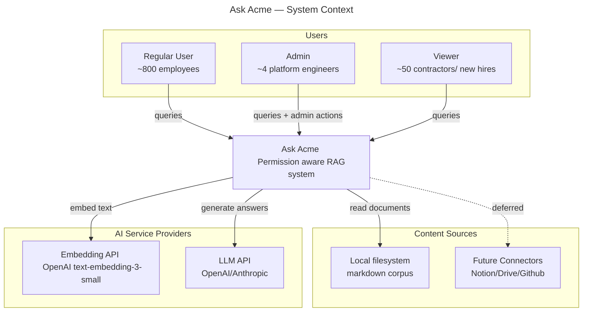

# Diagram 2: System Context

Renders Ask Acme in its environment — who calls it, what it depends on.

```mermaid
---
title: Ask Acme — System Context
---
flowchart TB
    User["Regular User <br/> ~800 employees"]
    Admin["Admin <br/> ~4 platform engineers"]
    Viewer["Viewer <br/> ~50 contractors/ new hires"]
    Local_FileSystem["Local filesystem <br/> markdown corpus"]
    Future_Connectors["Future Connectors <br/> Notion/Drive/Github"]
    Ask_Acme["Ask Acme <br/> Permission aware RAG system"]
    Embedding_Api["Embedding API <br/> OpenAI text-embedding-3-small"]
    LLM_Api["LLM API <br/> OpenAI/Anthropic"]

    subgraph Users
        User
        Admin
        Viewer
    end

    User -- queries --> Ask_Acme
    Admin -- "queries + admin actions" --> Ask_Acme
    Viewer -- queries --> Ask_Acme

    subgraph Content_Sources["Content Sources"]
        Local_FileSystem
        Future_Connectors
    end
    Ask_Acme -- "read documents" --> Local_FileSystem
    Ask_Acme -. deferred .-> Future_Connectors

    subgraph AI_Service_Provider["AI Service Providers"]
        Embedding_Api
        LLM_Api
    end

    Ask_Acme -- "embed text" --> Embedding_Api
    Ask_Acme -- "generate answers" --> LLM_Api
```
