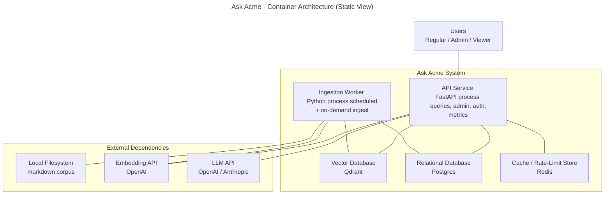

# Diagram 3a: Container Architecture (Static View)

The five runtime units that make up Ask Acme, with their external dependencies. Undirected lines indicate that two components communicate; direction of calls is shown in the dynamic diagrams (3b, 3c).

