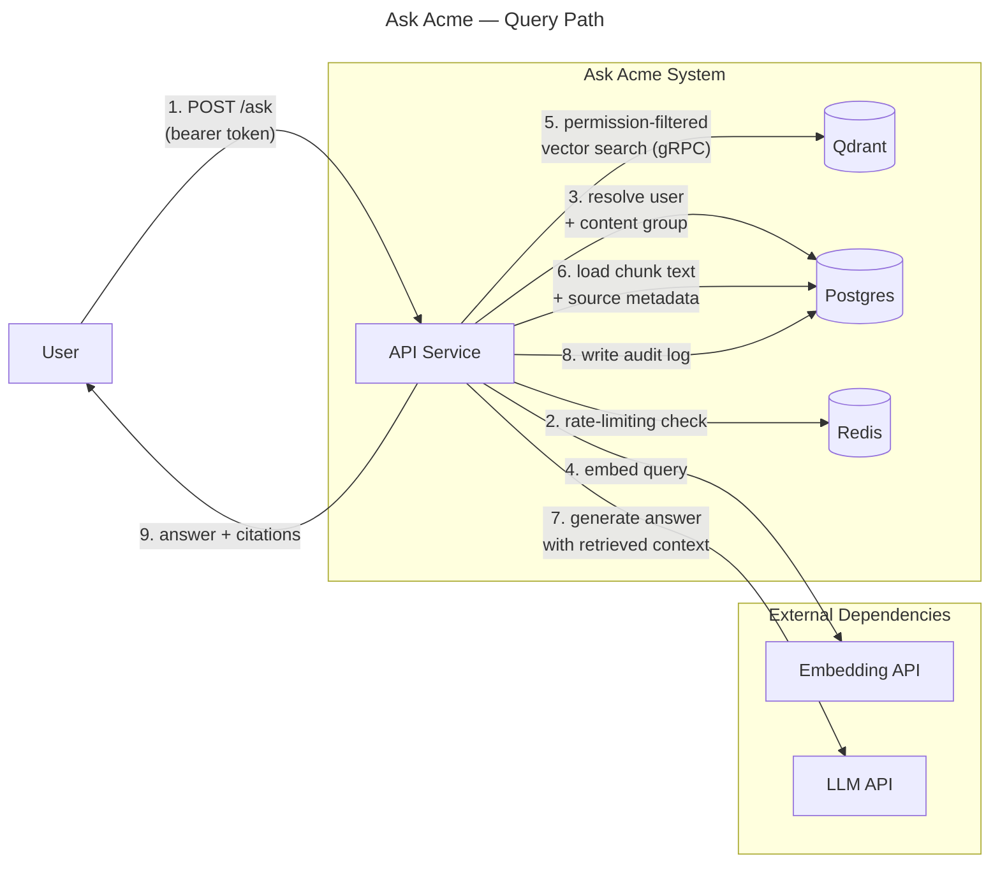

# Diagram 3b: Query Path

What happens when a user submits a query. Arrows numbered in execution order. Ingestion-only components omitted.

```mermaid
---
title: Ask Acme — Query Path
---
flowchart LR
    User["User"]
    API_Service["API Service"]
    Vector_DB[("Qdrant")]
    Relational_DB[("Postgres")]
    Cache_Rate_Limit[("Redis")]
    Embedding_API["Embedding API"]
    LLM_API["LLM API"]

    subgraph AskAcme["Ask Acme System"]
        direction LR
        API_Service
        Vector_DB
        Relational_DB
        Cache_Rate_Limit
    end

    subgraph External["External Dependencies"]
        direction TB
        Embedding_API
        LLM_API
    end

    User -- "1. POST /ask <br/>(bearer token)" --> API_Service
    API_Service -- "2. rate-limiting check" --> Cache_Rate_Limit
    API_Service -- "3. resolve user <br/>+ content group" --> Relational_DB
    API_Service -- "4. embed query" --> Embedding_API
    API_Service -- "5. permission-filtered <br/> vector search (gRPC)" --> Vector_DB
    API_Service -- "6. load chunk text <br/>+ source metadata" --> Relational_DB
    API_Service -- "7. generate answer <br/> with retrieved context" --> LLM_API
    API_Service -- "8. write audit log" --> Relational_DB
    API_Service -- "9. answer + citations" --> User
```
