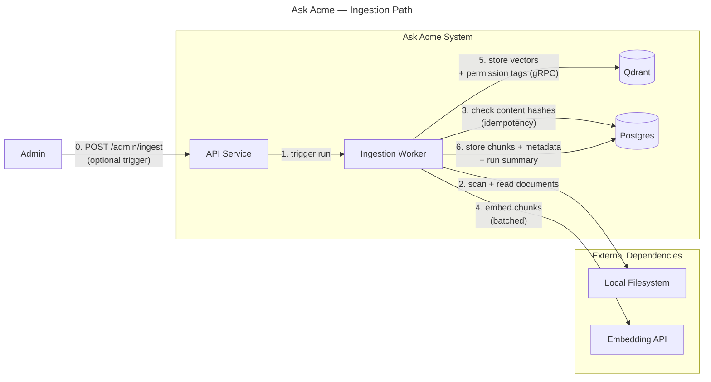

# Diagram 3c: Ingestion Path

What happens during ingestion. Triggered either by scheduler (default every 30 min, FR-30) or by Admin via API Service (FR-25).

```mermaid
---
title: Ask Acme — Ingestion Path
---
flowchart LR
    Admin["Admin"]

    subgraph AskAcme["Ask Acme System"]
        direction LR
        API_Service["API Service"]
        Ingestion_Worker["Ingestion Worker"]
        Vector_DB[("Qdrant")]
        Relational_DB[("Postgres")]
    end

    subgraph External["External Dependencies"]
        direction TB
        Local_FS["Local Filesystem"]
        Embedding_API["Embedding API"]
    end

    Admin -- "0. POST /admin/ingest <br/>(optional trigger)" --> API_Service
    API_Service -- "1. trigger run" --> Ingestion_Worker
    Ingestion_Worker -- "2. scan + read documents" --> Local_FS
    Ingestion_Worker -- "3. check content hashes <br/> (idempotency)" --> Relational_DB
    Ingestion_Worker -- "4. embed chunks <br/> (batched)" --> Embedding_API
    Ingestion_Worker -- "5. store vectors <br/> + permission tags (gRPC)" --> Vector_DB
    Ingestion_Worker -- "6. store chunks + metadata <br/> + run summary" --> Relational_DB
```
