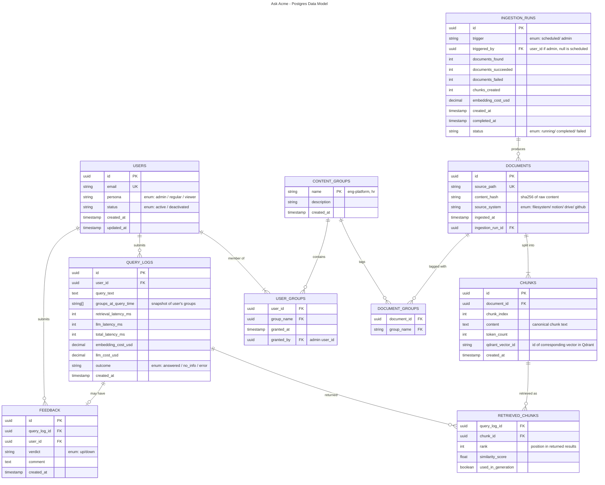

# Diagram 4: Data Model (Postgres)

Relational schema for Ask Acme's Postgres database. Qdrant's data structure is documented in HLD §4 prose.

```mermaid
---
title: Ask Acme - Postgres Data Model
---
erDiagram
    USERS ||--o{ FEEDBACK : "submits"
    USERS ||--o{ QUERY_LOGS : "submits"
    USERS ||--|{ USER_GROUPS : "member of"
    QUERY_LOGS ||--o| FEEDBACK : "may have"
    CONTENT_GROUPS ||--o{ USER_GROUPS : "contains"
    CONTENT_GROUPS ||--o{ DOCUMENT_GROUPS : "tags"
    DOCUMENTS ||--o{ DOCUMENT_GROUPS : "tagged with"
    INGESTION_RUNS ||--o{ DOCUMENTS : "produces"
    DOCUMENTS ||--|{ CHUNKS : "split into"
    CHUNKS ||--o{ RETRIEVED_CHUNKS : "retrieved as"
    QUERY_LOGS ||--o{ RETRIEVED_CHUNKS : "returned"

    USERS{
        uuid id PK
        string email UK
        string persona "enum: admin / regular / viewer"
        string status "enum: active / deactivated"
        timestamp created_at
        timestamp updated_at
    }

    FEEDBACK{
        uuid id PK
        uuid query_log_id FK
        uuid user_id FK
        string verdict "enum: up/down"
        text comment
        timestamp created_at
    }

    USER_GROUPS{
        uuid user_id FK
        uuid group_name FK
        timestamp granted_at
        uuid granted_by FK "admin user_id"
    }

    CONTENT_GROUPS{
        string name PK "eng-platform, hr"
        string description
        timestamp created_at
    }

    DOCUMENT_GROUPS{
        uuid document_id FK
        string group_name FK
    }

    DOCUMENTS{
        uuid id PK
        string source_path UK
        string content_hash "sha256 of raw content"
        string source_system "enum: filesystem/ notion/ drive/ github"
        timestamp ingested_at
        uuid ingestion_run_id FK
    }

    QUERY_LOGS{
        uuid id PK
        uuid user_id FK
        text query_text
        string[] groups_at_query_time "snapshot of user's groups"
        int retrieval_latency_ms
        int llm_latency_ms
        int total_latency_ms
        decimal embedding_cost_usd
        decimal llm_cost_usd
        string outcome "enum: answered / no_info / error"
        timestamp created_at
    }

    CHUNKS{
        uuid id PK
        uuid document_id FK
        int chunk_index
        text content "canonical chunk text"
        int token_count
        string qdrant_vector_id "id of corresponding vector in Qdrant"
        timestamp created_at
    }

    RETRIEVED_CHUNKS{
        uuid query_log_id FK
        uuid chunk_id FK
        int rank "position in returned results"
        float similarity_score
        boolean used_in_generation
    }

    INGESTION_RUNS{
        uuid id PK
        string trigger "enum: scheduled/ admin"
        uuid triggered_by FK "user_id if admin, null is scheduled"
        int documents_found
        int documents_succeeded
        int documents_failed
        int chunks_created
        decimal embedding_cost_usd
        timestamp created_at
        timestamp completed_at
        string status "enum: running/ completed/ failed"
    }
```
