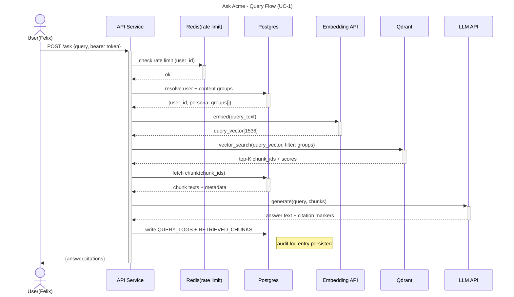

# Diagram 5.1: Query Flow (UC-1)

Successful query end-to-end. Failure paths are described in HLD §5.1 prose.

```mermaid
---
title: Ask Acme - Query Flow (UC-1)
---
sequenceDiagram
    actor user as User(Felix)
    participant api_service as API Service
    participant redis as Redis(rate limit)
    participant postgres as Postgres
    participant embedding_api as Embedding API
    participant qdrant as Qdrant
    participant llm_api as LLM API

    user ->>+ api_service: POST /ask {query, bearer token}
    api_service ->>+ redis: check rate limit (user_id)
    redis -->>- api_service: ok
    api_service ->>+ postgres: resolve user + content groups
    postgres -->>- api_service: {user_id, persona, groups[]}
    api_service ->>+ embedding_api: embed(query_text)
    embedding_api -->>- api_service: query_vector[1536]
    api_service ->>+ qdrant: vector_search(query_vector, filter: groups)
    qdrant -->>- api_service: top-K chunk_ids + scores
    api_service ->>+ postgres: fetch chunk(chunk_ids)
    postgres -->>- api_service: chunk texts + metadata
    api_service ->>+ llm_api: generate(query, chunks)
    llm_api -->>- api_service: answer text + citation markers
    api_service ->>+ postgres: write QUERY_LOGS + RETRIEVED_CHUNKS
    Note right of postgres: audit log entry persisted
    api_service -->>- user: {answer,citations}
```
