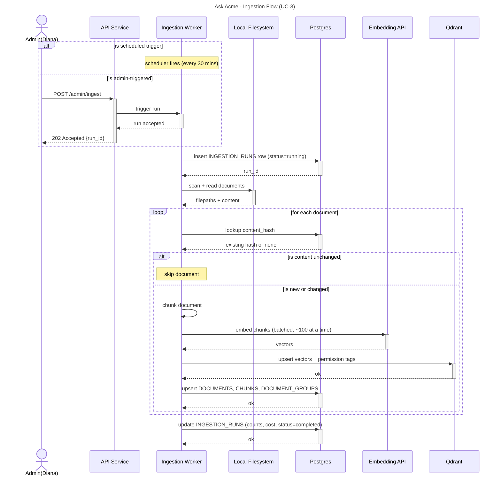

# Diagram 5.2: Ingestion Flow (UC-3)

End-to-end ingestion run. Triggered by scheduler or admin; flow is identical after triggering.

```mermaid
---
title: Ask Acme - Ingestion Flow (UC-3)
---
sequenceDiagram
    actor admin as Admin(Diana)
    participant api_service as API Service
    participant ingestion_worker as Ingestion Worker
    participant local_fs as Local Filesystem
    participant postgres as Postgres
    participant embedding_api as Embedding API
    participant qdrant as Qdrant

    alt is scheduled trigger
        Note over ingestion_worker: scheduler fires (every 30 mins)
    else is admin-triggered
        admin ->>+ api_service: POST /admin/ingest
        api_service ->>+ ingestion_worker: trigger run
        ingestion_worker -->>- api_service: run accepted
        api_service -->>- admin: 202 Accepted {run_id}
    end

    ingestion_worker ->>+ postgres: insert INGESTION_RUNS row (status=running)
    postgres -->>- ingestion_worker: run_id
    ingestion_worker ->>+ local_fs: scan + read documents
    local_fs -->>- ingestion_worker: filepaths + content

    loop for each document
        ingestion_worker ->>+ postgres: lookup content_hash
        postgres -->>- ingestion_worker: existing hash or none

        alt is content unchanged
            Note over ingestion_worker: skip document
        else is new or changed
            ingestion_worker ->> ingestion_worker: chunk document
            ingestion_worker ->>+ embedding_api: embed chunks (batched, ~100 at a time)
            embedding_api -->>- ingestion_worker: vectors
            ingestion_worker ->>+ qdrant: upsert vectors + permission tags
            qdrant -->>- ingestion_worker: ok
            ingestion_worker ->>+ postgres: upsert DOCUMENTS, CHUNKS, DOCUMENT_GROUPS
            postgres -->>- ingestion_worker: ok
        end
    end

    ingestion_worker ->>+ postgres: update INGESTION_RUNS (counts, cost, status=completed)
    postgres -->>- ingestion_worker: ok
```
