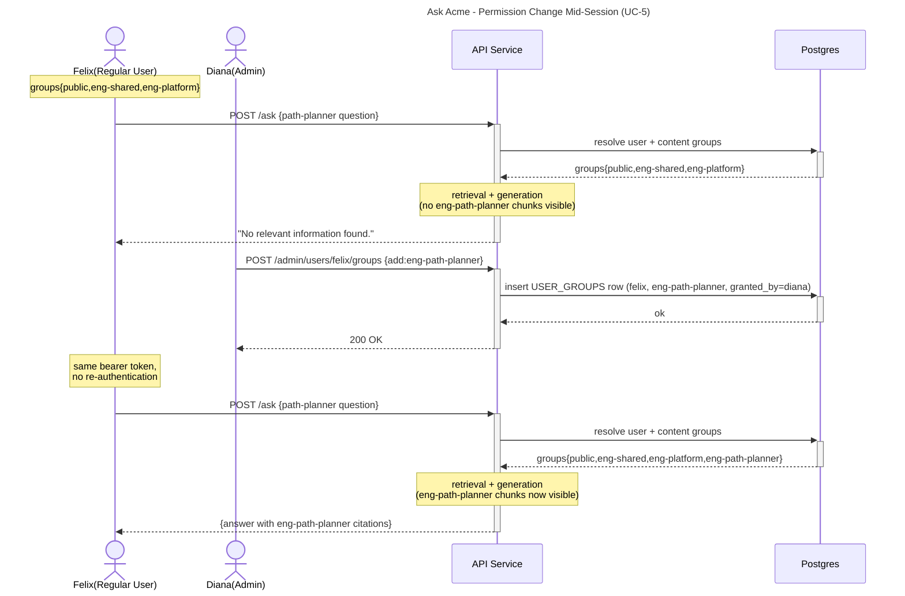

# Diagram 5.3: Permission Change Mid-Session (UC-5)

Demonstrates NFR-13: permission decisions are not cached across requests. A permission grant by an admin takes effect on the user's next query without re-authentication.

